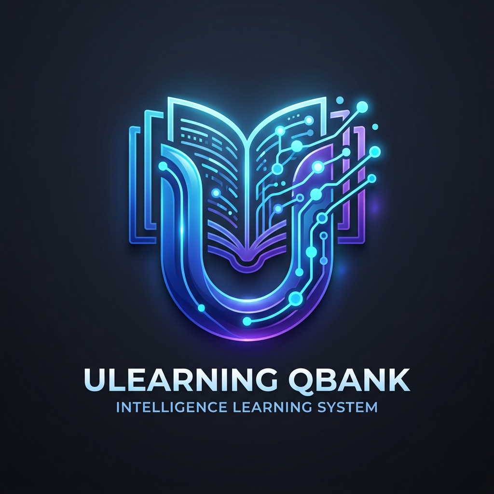
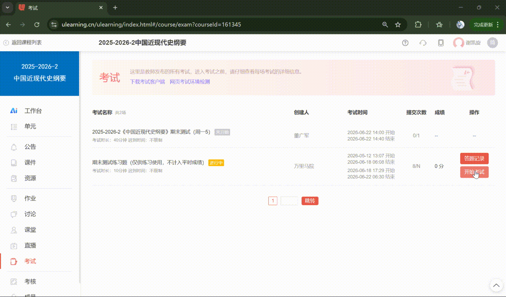
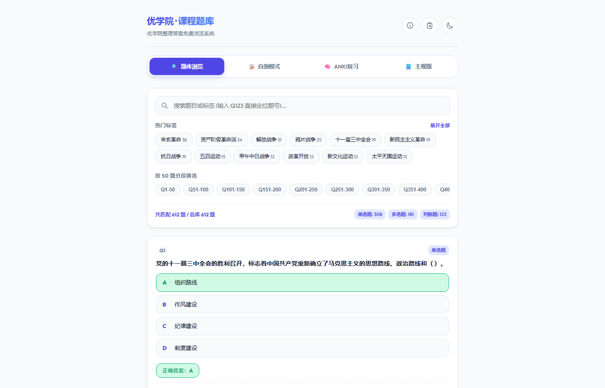
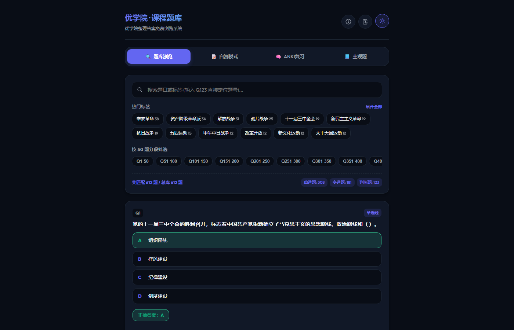
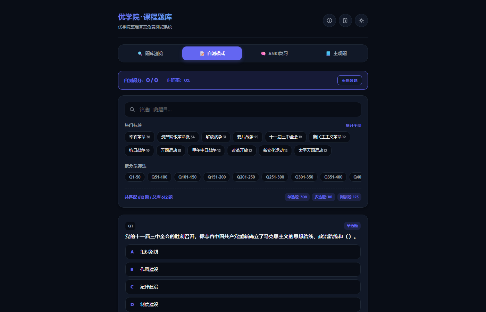
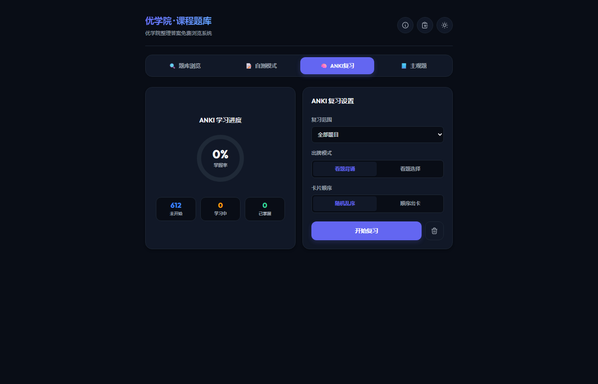
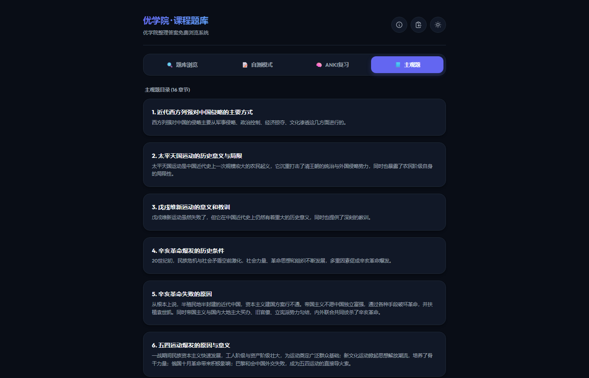

<p align="center">
  
</p>

# Ulearning 题库获取与构建流水线 / Ulearning Qbank Extraction & Build Pipeline

[](https://opensource.org/licenses/Apache-2.0)

一个开源、通用的优学院（Ulearning）练习题库获取、LLM 解答标注与现代交互式网页构建的完整流水线系统。

An open-source, generic pipeline system for retrieving Ulearning question banks, batch-solving questions with LLM, and building beautiful, interactive web viewers.

---

## ⚠️ 重要声明 / IMPORTANT DISCLAIMERS

**本工具仅供学习与复习使用 / For Educational & Revision Use Only**

1. **无法获取未公开题目**：本工具只能获取练习或教师公开的练习题库，无法提前获取保密考试的题目。
2. **遵守速率限制**：下载和接口请求配有默认延时（如下载延时1秒、LLM并发控制等），请合理调用，切勿恶意刷屏。
3. **数据隐私安全**：生成的 `config.json` 包含您个人的 Authorization 令牌，切勿上传至任何公开代码库。

---

## 🚀 核心流程与运行 / Pipeline Overview & Running

本项目支持通过主控脚本 `pipeline.py` 一键或分步完成所有操作。

### 第一步：一键生成配置
1. 登录 [优学院](https://utest.ulearning.cn) 并在弹出新标签页的练习页面按 `F12` 或 `Ctrl+Shift+I` 打开开发者工具控制台 (**Console**)。
2. 复制 [generate_config.js](generate_config.js) 中的所有代码粘贴并回车运行。
3. 在页面上点击“开始做题”或切换题目以发送请求，然后在控制台运行：`showConfig()`。
4. 将复制的内容在项目根目录保存为 `config.json`（可参考 `config.example.json` 模板配置 OpenAI API 等）。

### 第二步：运行流水线
```bash
# 启动交互式控制台菜单选择性执行
python pipeline.py

# 或直接运行全部步骤 (步骤 1 ~ 6)
python pipeline.py --step all
```

---

## 📂 项目结构 / Project Structure

```
ulearning-qbank/
├── generate_config.js       # [Console JS] 用于从浏览器捕获令牌和参数的辅助脚本
├── config.example.json      # 配置文件模板 (含爬虫、OpenAI、自定义路径)
├── config.json              # 您的配置文件 (运行 JS 脚本生成，被 git 忽略)
├── requirements.txt         # 推荐运行的依赖文件
├── README.md                # 本文件
├── QUICKSTART.md            # 快速入门指南
├── pipeline.py              # 流水线主控脚本 (主入口)
│
├── src/                     # 流水线核心组件
│   ├── downloader.py        # [步骤 1] 试卷爬取/下载器
│   ├── analyzer.py          # [步骤 2] 题目提取与去重解析器
│   ├── solver.py            # [步骤 3] LLM 批量智能答题与解析器
│   ├── tag_generator.py     # [步骤 4] LLM 知识点标签提取器
│   ├── tag_normalizer.py    # [步骤 5] 基于规则的标签规范与别名合并器
│   ├── viewer_builder.py    # [步骤 6] 网页构建器 (将数据打包入 HTML 单文件)
│   ├── utils.py             # 通用工具函数 (配置解析、文本清理等)
│   └── templates/
│       └── viewer_template.html # 网页交互版题库阅读器模板 (现代唯美、支持深色模式)
│
└── examples/                # 示例数据集
    └── modern-history/      # 已经构建好的示例题库 (科目: 中国近现代史纲要)
        ├── config.json      # 本地验证该示例所需的测试路径配置
        ├── question_bank.json # 原始解析题库
        ├── batch_results.jsonl # LLM 答题与解析缓存
        ├── title_tags.jsonl # 生成的规范标签文件
        ├── subjective.json  # 整理的主观题大纲
        └── final_answers.html # 生成的交互式网页题库
```

---

## 🛠️ 流水线步骤解析 / Detailed Pipeline Steps

### 1. 试卷下载 / Downloader
```bash
python src/downloader.py
```
读取 `config.json` 中配置的试卷 ID 范围（`paper_range`），模拟浏览器并发请求下载优学院的试卷原始 JSON 文件到 `papers_json/`。

### 2. 题目去重与解析 / Analyzer
```bash
python src/analyzer.py
```
扫描 `papers_json/` 目录中的所有试卷文件，将其中的重复题目进行过滤去重，对 HTML 字符进行解码，提取并生成 `question_bank.json` 和普通的 `question_bank.md`。

### 3. LLM 智能作答与解析 / Solver
```bash
python src/solver.py
```
读取 `question_bank.json`，根据配置的 OpenAI / Gemini 等 API 信息，对没有参考答案的题目进行批量作答。输出 `batch_results.jsonl` (包含推理思考过程 `<think>`、题意分析 `<analysis>` 以及提取的最终答案 `<final>`)。

### 4. 知识点标签提取 / Tag Generator
```bash
python src/tag_generator.py
```
结合题目与答案，使用大语言模型为每道题目自动抽取 2~4 个具体的知识点短语标签（如 "辛亥革命"、"十一届三中全会"），存入 `title_tags.jsonl` 中，用于后续网页里的多维搜索和知识过滤。

### 5. 标签清洗与别名合并 / Tag Normalizer
```bash
python src/tag_normalizer.py
```
基于预设规则过滤泛词（例如 "思想"、"原则" 等无意义宽泛词），规范并合并常见别名（例如把 "百日维新" 合并为 "戊戌变法"），保证标签系统的精简。

### 6. HTML 交互式题库构建 / Viewer Builder
```bash
python src/viewer_builder.py
```
读取题库、答题结果、合并后的标签，以及配置的 `subjective.json`（主观复习题与讲义大纲），配合 `viewer_template.html` 网页模板，将所有题库数据以极其紧凑的 JSON 格式硬编码打入最终的 `final_answers.html` 静态页面中。
- *标签生成机制（自动 Fallback 降级）*：网页构建时优先加载大模型生成的规范标签（从 `title_tags.jsonl` 中读取）。若用户跳过了大模型步骤，或本地无大模型缓存文件，构建器会**自动降级调用本地 `jieba` 分词引擎**，从题干中抽取名词短语作为备用分类标签。如果本地既没有大模型缓存也未安装 `jieba` 库，则该题默认不显示标签，不会报错中断。
- *主观题与讲义大纲配置 (`subjective.json`)*：若需要展示主观题/复习大纲，可在项目根目录手动新建 `subjective.json`。如无该文件或内容为空，生成的网页会**自动隐藏主观题标签页**。
  
  **`subjective.json` 数据格式说明：**
  ```json
  {
    "chapters": [
      {
        "id": "第1章",
        "title": "章节标题 (例如：反对外国侵略的斗争)",
        "summary": "章节重点总结/概述（可选）",
        "sections": [
          {
            "heading": "问答题：如何理解鸦片战争是中国近代史的开端？",
            "content": "答案要点：鸦片战争改变了中国的社会性质、主要矛盾和革命任务...",
            "sub_points": [
              "1. 独立主权的领土完整遭到破坏，沦为半殖民地；",
              "2. 自给自足的自然经济开始解体，沦为半封建国；",
              "3. 主要矛盾转化为帝国主义与中华民族的矛盾、封建主义与人民大众的矛盾。"
            ]
          }
        ]
      }
    ]
  }
  ```

---

## 🎨 网页端交互功能特色

编译出来的 `final_answers.html` 是一个高颜值、单文件（完全离线）的交互式学习网页：
- 🌟 **答题记录与检测**：支持答题状态缓存，记录哪些题已懂、哪些题答错，并在错题本中查看。
- 🔍 **多功能过滤**：支持通过**题型**、**知识点标签**、**自定义关键词**、**收藏状态**以及**错题状态**等组合过滤题目。
- 🌓 **极致视觉体验**：原生支持现代浅色/深色主题，响应式设计，完美适配 PC、平板和手机端。
- 📚 **主观与讲义扩展**：支持主观复习重点的按章节划分，便于在刷客观题的同时对照讲义。

---

## 🎬 操作演示与界面展示 / Walkthrough & Demo

### 1. Git & 运行步骤演示 / Git Workflow Walkthrough
以下是抓取配置并运行流水线的具体操作流程演示：



### 2. 交互网页界面预览 / Web Viewer Preview

| 浏览模式 (浅色主题) | 浏览模式 (深色主题) |
| :---: | :---: |
|  |  |

| 模拟自测 (深色主题) | Anki 记忆卡片 (深色主题) | 主观重点讲义 (深色主题) |
| :---: | :---: | :---: |
|  |  |  |

---


## 🤝 贡献与反馈

如果您在使用过程中发现平台接口发生了更新导致失效，欢迎提交 Issue。也欢迎丰富 `tag_normalizer.py` 中的清洗别名规则！

## 📄 许可证与合规承诺 / License & Compliance

本项目使用 [Apache 2.0](LICENSE) 开源许可证，并附带平台合规性免责声明（详见 [LICENSE](LICENSE) 底部文件）：
- **合规声明**：若优学院官方或相关主体要求下架或停止分发，项目将立即并无条件配合删除、停用本工具。“如果平台不让搞，那就别搞了”，请使用者严格自律。
